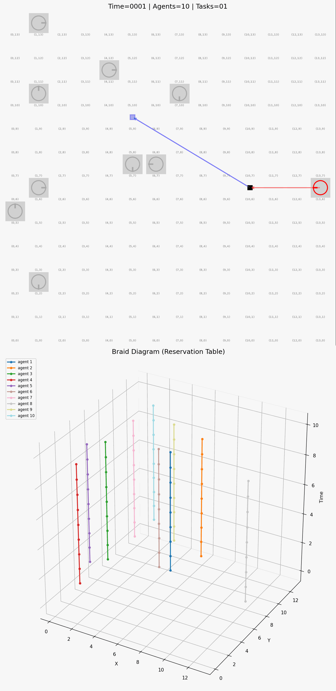

# Karma Mechanisms for Decentralised, Cooperative Multi Agent Path Finding

Kevin Riehl, Julius Schlapbach, Anastasious Kouvelas, Michail A. Makridis
(ETH Zürich, Institute for Transport Planning and Systems (IVT))

<details>
<summary><strong>Table of Contents</strong></summary>

- [Introduction](#introduction)
- [Abstract](#abstract)
- [What you will find in this repository](#what-you-will-find-in-this-repository)
- [Installation Instructions](#installation-instructions)
- [Run Instructions](#run-instructions)
  - [Run Simulation & Visualization](#run-simulation)
  - [Run Simulation & Performance Evaluation](#run-simulation)
  - [Replicate Findings from the paper](#replicate-findings)
- [Results](#results)
- [Citation](#citation)
</details>

## Introduction

This is the online repository of "Karma Mechanisms for Decentralised, Cooperative Multi Agent Path Finding". This repository contains a Python-implementation of a warehouse-like MAPD simulation, in which robots with kinematic constraints (orientation-awareness) navigate on a two-dimensional grid, and pickup and dropoff randomly generated tasks.

<table>
<tr>
<td></td>
<td></td>
</tr>
<tr>
<td><b><center>CBS (Centralised)</center></b></td>
<td><b><center>Token-Passing</center></b></td>
</tr>
<tr>
<td></td>
<td></td>
</tr>
<tr>
<td><b><center>Negotiation (Egoistic)</center></b></td>
<td><b><center>Negotiation (Karma)</center></b></td>
</tr>
</table>

<table>
<tr>
<td></td>
<td></td>
<td></td>
<td></td>
</tr>
<tr>
<td><b><center>5x5<br>(10 agents)</center></b></td>
<td><b><center>10x10<br>(30 agents)</center></b></td>
<td><b><center>15x15<br>(80 agents)</center></b></td>
<td><b><center>20x20<br>(140 agents)</center></b></td>
</tr>
</table>

## Abstract

Multi-Agent Path Finding (MAPF) is a fundamental coordination problem in large-scale robotic and cyber-physical systems, where multiple agents must compute conflict-free trajectories with limited computational and communication resources.
While centralised optimal solvers provide guarantees on solution optimality, their exponential computational complexity limits scalability to large-scale systems and real-time applicability.
Existing decentralised heuristics are faster, but lead to suboptimal outcomes and result in high disparities in costs.
This paper proposes a decentralised coordination framework for cooperative MAPF based on Karma mechanisms -- artificial, non-transferable credits that encode agents’ histories of cooperative behaviour and regulate future conflict resolution decisions.
The approach formulates conflict resolution as a bilateral negotiation process that enables agents to resolve conflicts through pairwise replanning while promoting long-term fairness under limited communication and without global priority structures.
The mechanism is evaluated in a lifelong robotic warehouse multi-agent pickup-and-delivery scenario with kinematic orientation constraints.
Unlike established, decentralised heuristics, the proposed Karma mechanism regulates the temporal distribution of replanning effort across agents, improving fairness while maintaining efficiency.

## What you will find in this repository

This repository contains the simulation model and source code to reproduce the findings of our study. The folder contains following information:

```
./
├── figures/            # paper figure scripts and the rendered PNGs
├── results/            # analysis outputs the figures are rendered from
│   └── animations/     # GIFs shown in this README
└── src/
    ├── planners/       # A*, CBS and task assignment planners
    ├── scripts/        # simulation, analysis and animation entry points
    └── simulation/     # environment, agents, tasks, negotiation, metrics
```

## Installation Instructions

Create a virtual environment and install dependencies with:

```
python3.13 -m venv venv && source venv/bin/activate
pip install -r requirements.txt
```

All scripts below are run from the repository root with the virtual environment active, after making the root importable once per shell:

```
export PYTHONPATH=.
```

## Run Instructions

### Run Simulation & Visualization

You can run the simulation with different `mapf_control` settings and generate a GIF file in `results/animations/`, by executing:

```
python src/scripts/visualize_simulation.py
```

There are multiple settings you can adjust at the beginning of the script:

```python
simulation_settings = {
    "random_seed": 42,
    "grid_size": 20 + 2,  # 15,
    "n_agents": 180,
    # "mapf_control": MAPF_CONTROLLER_CENTRALIZED,
    # "mapf_control": MAPF_CONTROLLER_DECENTRALIZED_TOKEN_PASSING,
    # "mapf_control": MAPF_CONTROLLER_DECENTRALIZED_NEGOTIATE_EGOISTIC,
    "mapf_control": MAPF_CONTROLLER_DECENTRALIZED_NEGOTIATE_UTILITARIAN,
    # "mapf_control": MAPF_CONTROLLER_DECENTRALIZED_NEGOTIATE_TRIP_KARMA,
    "time_horizon_visualization": 10,
    "time_simulation_duration": 100,
    "params_astar": {
        "max_iterations": 1e5,
        "planning_horizon": int(20 * 20),
        "planning_horizon_buffer": 20,
    },
    "params_cbs": {
        "max_iterations": 5000,
        "MAX_IDLE_TIME_CONSIDERED": 20,
        "PLANNING_HORIZON": 100,
    },
    "params_karma": {
        "initial_karma": 0,
        "delta_threshold": 0,
        "karma_influence": 0.5,
    },
    "debug_statements": False,
}
```

### Run Simulation & Performance Evaluation

You can run the simulation with different `mapf_control` settings and generate print statements about the performance of the controller during the simulation by executing:

```
python src/scripts/performance_tracking.py
```

This generates a performance summary like:

```
=====================================================
Experiment Results for algorithm DECENTRALIZED_NEGOTIATE_UTILITARIAN over 10 experiments
=====================================================
A* calls:        mean = 168357.700 	 std = 10569.894
Completed tasks: mean = 507.700 	 std = 7.669
Total cost:      mean = 9213.300 	 std = 16.710
Avg cost:        mean = 18.151 	 std = 0.273
Distribution:    mean = 5.612 	 std = 0.174
=====================================================
```

### Replicate Findings from the paper

To replicate the exact findings from the paper, you can execute the analysis scripts, which will generate results similar to those stored in the `results` folder:

```
python src/scripts/efficiency_benchmark.py        # results/efficiency_benchmark/      -> Figure_1
python src/scripts/time_distribution.py           # results/time_distribution/         -> Figure_2
python src/scripts/karma_influence.py             # results/karma_influence/           -> Figure_3
python src/scripts/karma_influence_tradeoffs.py   # results/karma_influence_tradeoffs/ -> Figure_4
python src/scripts/karma_influence_sweep.py       # results/runs/karma_influence_sweep/ (no paper figure)
```

To render the visualizations, please execute the scripts in the `figures` folder:

```
python figures/Figure_1.py
python figures/Figure_2.py
python figures/Figure_3.py
python figures/Figure_4.py
```

## Results

In the folder `results` you will find the outputs of each analysis stored in a dedicated folder named after its script. Intermediate outputs of every run (per-seed results, reports, animation frames) are written to `results/runs/`, and `results/archive/` holds copies of previous runs. Both are ignored by git.

```
./
├── ...
├── results/
│   ├── animations/
│   ├── efficiency_benchmark/
│   ├── time_distribution/
│   ├── karma_influence/
│   ├── karma_influence_tradeoffs/
│   ├── runs/
│   └── archive/
└── ...
```

## Citation

If you found this repository helpful, please cite our work:

```
Kevin Riehl, Julius Schlapbach, Anastasios Kouvelas, Michail A. Makridis
"Karma Mechanisms for Decentralised, Cooperative Multi Agent Path Finding", 2026.
Submitted to CDC2026: 65th IEEE Conference on Decision and Control, Honolulu, Hawaii.
```
